## Who I am

Servus! My name is Felix Weichselgartner and I'm an Electrical Engineering student from Lower Bavaria in Germany. Beside my study at the [Landshut University of Applied Sciences](https://www.haw-landshut.de/) I'm working as a software engineer for [Jungheinrich AG](https://www.jungheinrich.de/) in the department of automated guided vehicles. In my spare time I like to program and do different electrical projects. However, I also enjoy playing video games, skiing and reading.

## Curriculum Vitae

### Education

Current highest graduation: Fachhochschulreife

| Time period       | University                                    | Degree                                                               | Final Grade               |
|-------------------|-----------------------------------------------|----------------------------------------------------------------------|---------------------------|
| 2017/10 – 2021/02 | [Landshut UAS¹](https://www.haw-landshut.de/) | Bachelor of Engineering   Electrical and Informations Engineering | mit Auszeichnung 1,1 |
| 2020/10 – today   | [Landshut UAS¹](https://www.haw-landshut.de/) | Master of Engineering   Electrical Engineering                    |                           |

### Working experience

| Time period       | Employer                                                                | Job title                         |
|-------------------|-------------------------------------------------------------------------|-----------------------------------|
| 2016/07           | [Ingenieurbüro Greif](http://ib-greif.de/index.htm)                     | Intern                            |
| 2018/08           | [bbs-project AG](https://cargocollective.com/bbsproject)                | Intern                            |
| 2018/10 - 2019/02 | [Landshut UAS¹](https://www.haw-landshut.de/) | Tutor for EE² I                   |
| 2019/03 - 2019/07 | [Landshut UAS¹](https://www.haw-landshut.de/) | Tutor for EE² II                  |
| 2019/09 - 2019/12 | [Jungheinrich Moosburg AG & Co. KG](https://www.jungheinrich.de/)       | Intern practical semester - AGV³  |
| 2020/01 - today   | [Jungheinrich Moosburg AG & Co. KG](https://www.jungheinrich.de/)       | dual study program student - AGV³ |

¹: University of Applied Sciences

²: Electrical Engineering

³: automated guided vehicles

## Competencies

TOOLS: Visual Studio Code , PyCharm 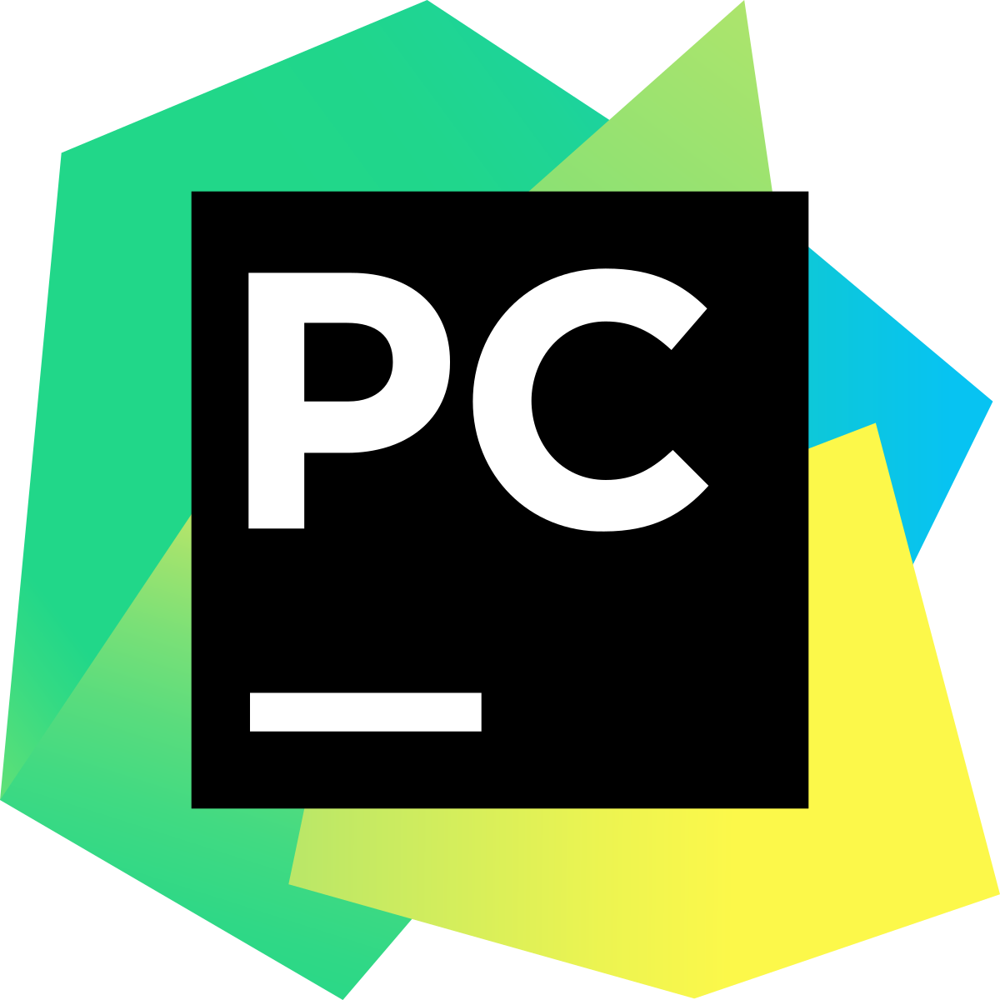, git 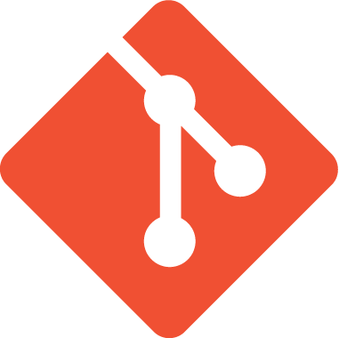, GitHub , Docker 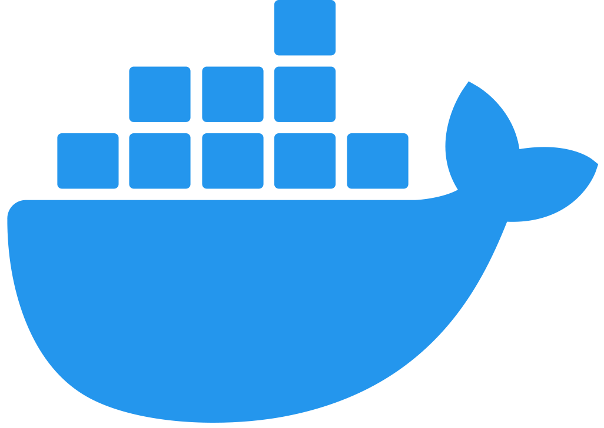, CMake 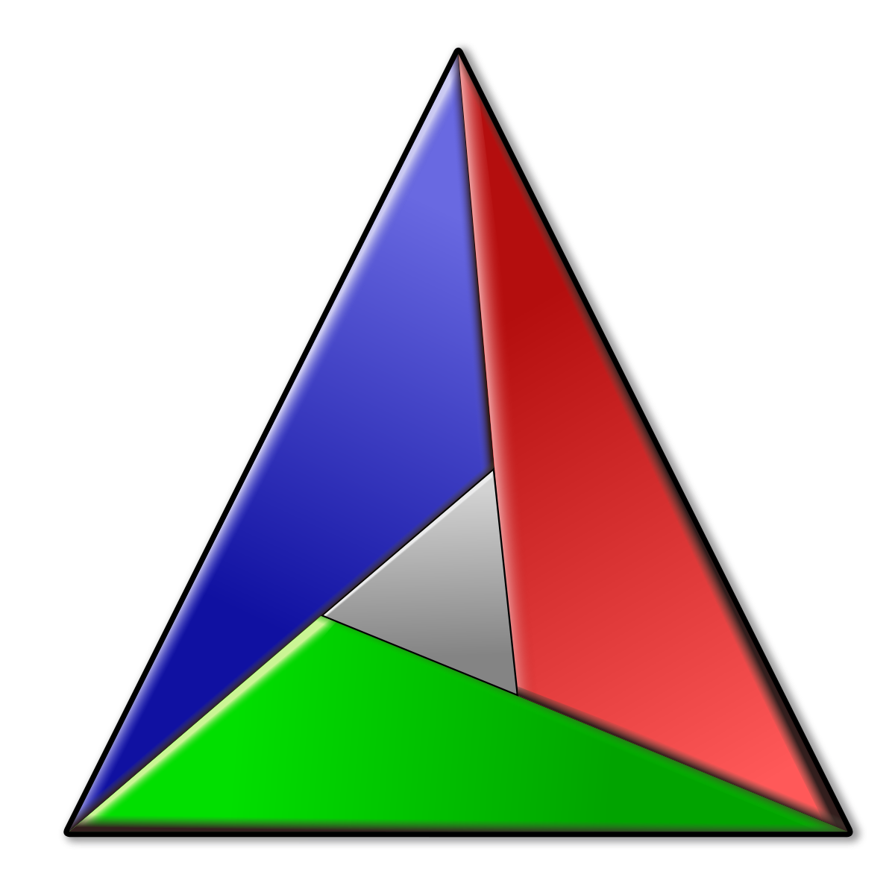, Linux

LOW LEVEL: C , C++ , CPU (Assembly) Emulation

HIGH LEVEL: Python3 , OpenCV 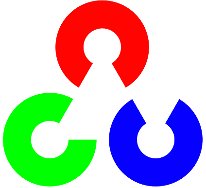, Qt 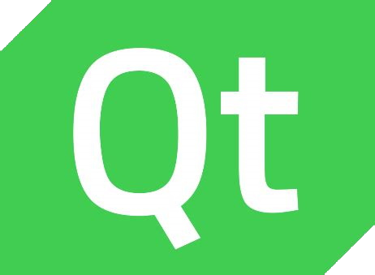, C# 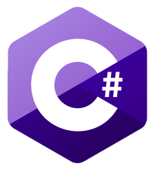, Java 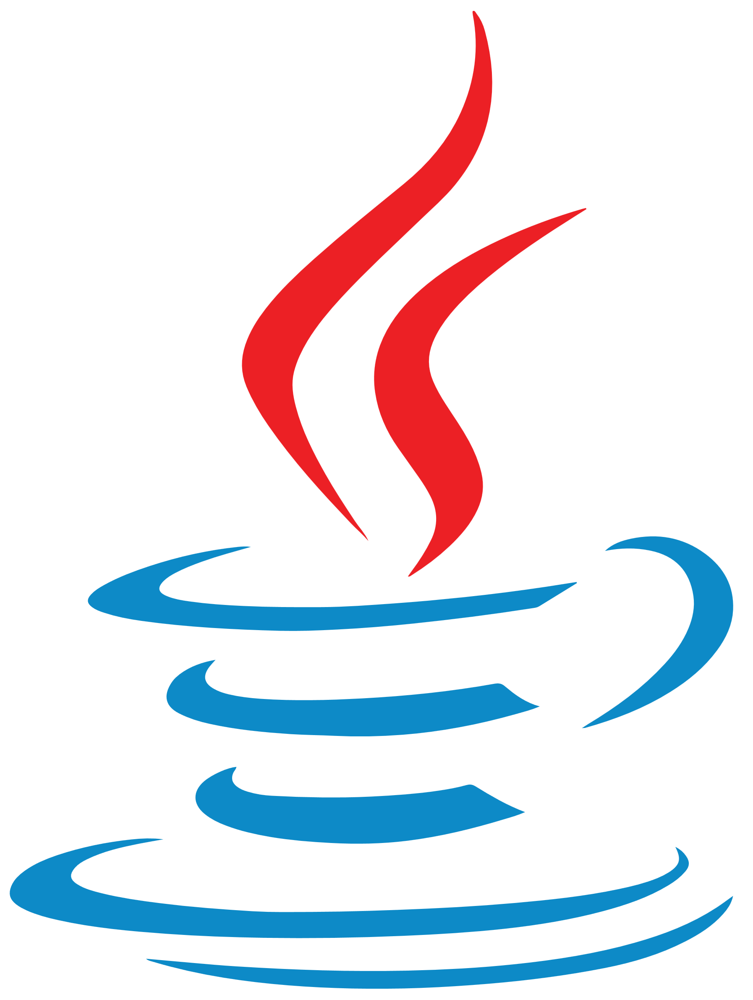

WEB-DEV: Django , Flask , HTML5 , CSS , SQLite3 

ELECTRONICS: Raspberry Pi , Arduino , Eagle 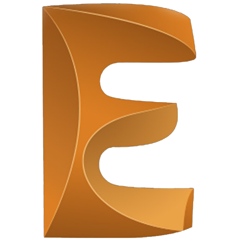, VHDL

SOFTWARE: Office , Word 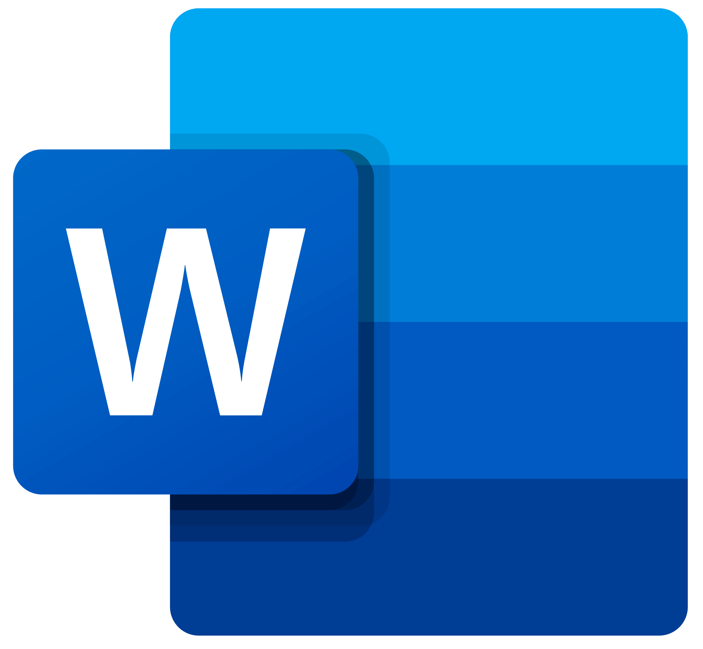, PowerPoint , Excel , Allplan 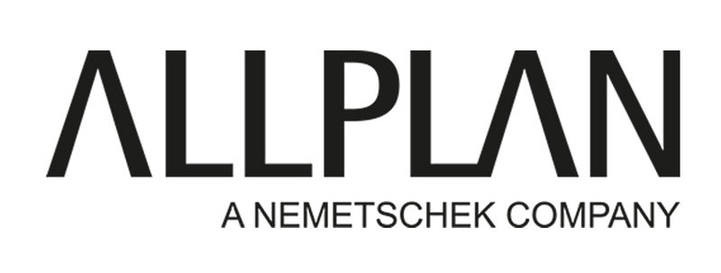, Wordpress 

LANGUAGES: Native German , 4 courses UNIcert III English

All logos are just for visualization – I do not claim any rights on them
