## Who I am

<table>
  <tr>
    <td> Servus! My name is Felix Weichselgartner and I'm an Electrical Engineer from Lower Bavaria in Germany. In my spare time I like to program and do different electrical projects. However, I also enjoy playing video games or 8 ball pool, skiing and reading. </td>
    <td style="width:250px; height:250px; text-align:center; vertical-align:middle">
      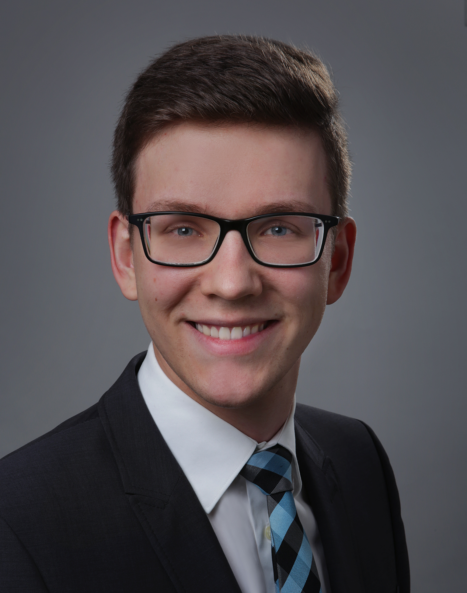
    </td>
  </tr>
</table>

 

## Curriculum Vitae

### Education

I was able to finish Bachelor and Master in only 9 semesters (one semester faster than standard period of study), because I completed my 7th semester of the Bachelor and my 1st semester of the master simultaneously. 

<table id="vitae">
  <tr>
    <th>Time period</th>
    <th>University</th>
    <th>Degree</th>
    <th>Final Grade</th>
  </tr>
  <tr>
    <td>2017/10 – 2021/02</td>
    <td><a href="https://www.haw-landshut.de/">Landshut UAS¹</a></td>
    <td>Bachelor of Engineering   Electrical Engineering and Information Technology</td>
    <td>with excellence  1.1</td>
  </tr>
    <tr>
    <td>2020/10 – 2022/03</td>
    <td><a href="https://www.haw-landshut.de/">Landshut UAS¹</a></td>
    <td>Master of Engineering   Electrical Engineering</td>
    <td>very good  1.3</td>
  </tr>
</table>

 

<table id="vitae">
  <tr>
    <th>Time period</th>
    <th>Institution</th>
    <th>Continued Education</th>
  </tr>
  <tr>
    <td>2022/03 – 2022/08</td>
    <td><a href="https://gih-bayern.de/energieberatung/wohngebaeude/">GIH Bayern</a></td>
    <td>Ausbildung zum Energieberater Wohngebäude   (Gebäudeenergieberater)</td>
  </tr>
</table>

 

### Working experience

<table id="vitae">
  <tr>
    <th>Time period</th>
    <th>Employer</th>
    <th>Job title</th>
  </tr>
  <tr>
    <td>2016/07</td>
    <td><a href="http://ib-greif.de/index.htm">Ingenieurbüro Greif</a></td>
    <td>Intern</td>
  </tr>
  <tr>
    <td>2018/08</td>
    <td><a href="https://cargocollective.com/bbsproject">bbs-project AG</a></td>
    <td>Intern</td>
  </tr>
  <tr>
    <td>2018/10 - 2019/02</td>
    <td><a href="https://www.haw-landshut.de/">Landshut UAS¹</a></td>
    <td>Tutor for EE² I</td>
  </tr>
  <tr>
    <td>2019/03 - 2019/07</td>
    <td><a href="https://www.haw-landshut.de/">Landshut UAS¹</a></td>
    <td>Tutor for EE² II</td>
  </tr>
  <tr>
    <td>2019/09 - 2022/02</td>
    <td><a href="https://www.jungheinrich.de/">Jungheinrich AG</a></td>
    <td>dual study program  student for AGVs³</td>
  </tr>
  <tr>
    <td>2022/03 - today</td>
    <td><a href="https://www.energieausweise.online/">Ingenieurbüro  Weichselgartner GmbH</a></td>
    <td>entrepreneurial activity</td>
  </tr>
</table>

¹: University of Applied Sciences \
²: Electrical Engineering \
³: Automated Guided Vehicles

 

### Publications

Both my Bachelor and Master Thesis were graded with a 1.0 (best grade possible). My Bachelor Thesis won the "[IHK-Preis](https://www.linkedin.com/posts/ihkniederbayern_ihkniederbayern-ihkpreis-beruflichebildung-activity-6956233764968534016-TL1C?utm_source=linkedin_share&utm_medium=member_desktop_web)" (IHK price) for being one of the best theses of the year 2020 in Lower Bavaria.

<table id="vitae">
  <tr>
    <th>Titel</th>
    <th>Publisher</th>
    <th>Publication date</th>
    <th>Type</th>
  </tr>
  <tr>
    <td>Automatisierte Koordinatensystemkalibrierung von Fahrerlosen Transportfahrzeugen mittels Bilderkennung   Translation: Automated coordinate system calibration of automated guided vehicles with computer vision</td>
    <td><a href="https://www.haw-landshut.de/">Landshut UAS¹</a></td>
    <td>17.07.2020*</td>
    <td>Bachelor Thesis</td>
  </tr>
  <tr>
    <td>Visualisierung der Parameter von Fahrerlosen Transportsystemen mittels Mixed Reality   Translation: Visualization of the parameters of automated guided vehicle systems with Mixed Reality</td>
    <td><a href="https://www.haw-landshut.de/">Landshut UAS¹</a></td>
    <td>09.03.2022*</td>
    <td>Master Thesis</td>
  </tr>
  <tr>
    <td>Verfahren zum Kalibrieren von Koordinatensystemen in Flurförderzeugen   Translation: Method for calibrating the coordinate systems in industrial trucks</td>
    <td><a href="https://register.dpma.de/DPMAregister/pat/register?AKZ=E221578883">Patentamt / patent office</a></td>
    <td>07.09.2022</td>
    <td>Patent application</td>
  </tr>
</table>

*: accessable 5 years later

 

## Competencies

**TOOLS:** \
Visual Studio Code , PyCharm , git 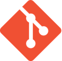, GitHub 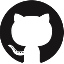, Docker , CMake 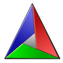, Linux, Grafana , Microsoft HoloLens 2

**LOW LEVEL:** \
C , C++ 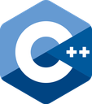, CPU (Assembly) Emulation

**HIGH LEVEL:** \
Python3 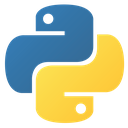, OpenCV , Qt , C# 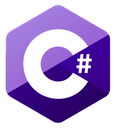, Java 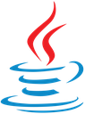

**WEB-DEV:** \
Django , Flask , HTML5 , CSS , MySQL, SQLite3 

**ELECTRONICS:** \
Raspberry Pi 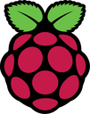, Arduino 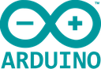, Eagle , VHDL

**SOFTWARE:** \
Office , Word , PowerPoint 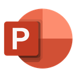, Excel , Allplan , Wordpress , Unity3D , LaTeX 

**LANGUAGES:** \
Native German , UNIcert III certified English

All logos are just for visualization – I do not claim any rights on them
